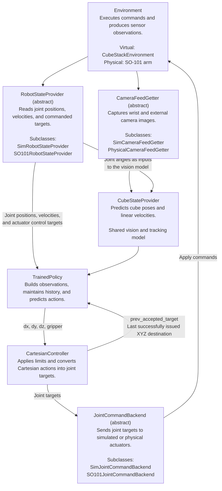

# Shared Simulation and Physical Robot Inference Plan

Status: proposed architecture and public interfaces; not implemented by this document.

## Overview

Use the same cube-perception model, trained policy, and Cartesian controller in
simulation and on the physical SO-101. Separate implementations provide robot
telemetry, camera frames, and joint-command execution.

The cube-perception model takes wrist images, external-camera images, and robot
joint angles as inputs. It learns to predict cube positions and orientations
directly in robot-base coordinates from a large, varied synthetic dataset.
Camera setup parameters are used to generate training images, not supplied as
runtime inputs to the perception model.

The `Environment` box represents the shared simulator or physical robot
connection, rather than another abstract class. Its creation and connection
lifecycle stay outside these components.

| Component | Implementations |
|---|---|
| `RobotStateProvider` | `SimRobotStateProvider`, `SO101RobotStateProvider` |
| `CameraFeedGetter` | `SimCameraFeedGetter`, `PhysicalCameraFeedGetter` |
| `CubeStateProvider` | One shared vision and tracking implementation |
| `TrainedPolicy` | One shared observation, history, and policy implementation |
| `CartesianController` | One shared controller using matching robot geometry |
| `JointCommandBackend` | `SimJointCommandBackend`, `SO101JointCommandBackend` |
| `LoopRunner` | One shared control-loop coordinator |

The two camera-provider implementations describe where images come from. Each
can supply both wrist and external-camera views.

## Architecture



`LoopRunner` coordinates the components in this diagram using `LoopRunnerConfig`,
with a default control frequency of 20 Hz.

## Shared resources and timing

- The simulated robot-state provider, camera provider, and command backend all
  receive references to the same `CubeStackEnvironment` instance. They do not
  create separate simulations or copy state through a separate shared store.
- On hardware, the robot-state provider and command backend share one connected
  LeRobot robot object. The camera provider owns or references the physical
  camera connections.
- Ordinary Python objects and method calls are sufficient initially; a
  publisher/subscriber framework is not required.
- Providers only read state or capture images. The simulated backend's
  `advance()` method is the sole owner of physics advancement in this design.
- One control iteration represents 50 ms at 20 Hz. That budget
  includes reading sensors, perception, policy inference, IK, and command
  transmission. Wait only for the remainder of the interval, rather than an
  additional 50 ms after sending commands.
- Do not wait for each joint target to be reached before starting the next
  iteration. Read the latest measured state while the robot continues moving.
- The shared loop uses wall-clock pacing in both simulation and hardware.
  Assume computation finishes within the configured interval for now; handling
  overruns is deferred. Simulation advances by one fixed interval per action.
- Joint ordering, joint directions and offsets, units, and robot geometry must
  match the model's observation and controller conventions. Forward and inverse
  kinematics remain responsible for robot motion; cube perception learns its
  image-to-robot-coordinate mapping.
- Retain simulator ground truth for vision-training labels and evaluation,
  while the shared runtime cube-state provider produces estimates from images.
- Resetting policy/controller bookkeeping is separate from resetting simulator
  physics or physically moving the robot to its starting pose.
- Task completion may initially be handled by manual intervention.

## Learned cube-state estimation

One shared vision model predicts cube poses directly from the two camera views
and robot joint angles. It learns the relationship between image appearance,
arm configuration, and robot-relative cube locations from training examples.

```text
Wrist image + external image + joint angles at image capture time
    -> Shared vision model
    -> Cube XYZ positions and orientations in robot-base coordinates
    -> Tracking across observations to estimate cube linear velocities
```

Images and joint readings retain timestamps so the model receives the arm
configuration corresponding to each image. Joint angles enter the learned
model alongside the images, and its pose predictions already use robot-base
coordinates.

### Perception training data

- Generate a large dataset spanning different wrist-camera mounting positions
  and angles, external-camera positions and angles, focal lengths, fields of
  view, and lens distortion.
- Vary lighting, shadows, backgrounds, textures, exposure, image noise, blur,
  and partial occlusion to cover varied visual conditions.
- Include varied arm configurations and cube positions and orientations during
  approaching, grasping, carrying, dropping, recovering, and stacking.
- Save paired camera images, corresponding joint angles, and the simulator's
  exact cube poses in robot-base coordinates. Use temporal sequences for
  tracking and linear-velocity estimation.
- Sample camera setups across examples or sequences. Within a sequence, keep
  mounts and lens settings consistent while the wrist camera follows the arm,
  matching ordinary operation on the physical robot.
- Train the model on these varied setups, then evaluate on held-out camera
  setups and real images. Measure cube-pose error and downstream stacking
  success to assess how well the learned mapping generalizes.

Simulator camera parameters belong to data generation. The runtime camera
provider supplies images, camera identifiers, and timestamps; the cube-state
provider uses those images and joint angles without per-camera geometry inputs.

## Common types

These names describe shared data records and array types, rather than additional
runtime components. Their concrete Python definitions remain to be implemented.

| Type | Contents |
|---|---|
| `Vec3` | Floating-point NumPy array, shape `(3,)`. |
| `JointVector` | Floating-point NumPy array, shape `(6,)`, in the agreed joint order. |
| `PolicyAction` | `np.ndarray`, shape `(4,)`: normalized `[dx, dy, dz, gripper]`. |
| `RobotState` | Timestamp, joint positions, joint velocities, commanded joint targets, and gripper XYZ. |
| `CameraFrame` | Camera identifier, capture timestamp, and RGB `np.ndarray` with shape `(height, width, 3)`. |
| `CameraFrames` | `dict[str, CameraFrame]`, typically containing `"wrist"` and `"external"`. |
| `CubeState` | Timestamp, XYZ position, quaternion orientation, and linear velocity relative to the robot base. |
| `CubeStates` | `dict[str, CubeState]`, containing `"orange"` and `"blue"`. |
| `PlannedCommand` | Joint targets, proposed accepted Cartesian target, and IK diagnostics. |
| `CommandReceipt` | Timestamp and the actual joint targets sent to the actuators. Successful transmission does not mean those positions have been reached. |
| `StepResult` | Input states, predicted action, planned command, and command receipt for one iteration. |

Providers convert values into the agreed units and coordinate conventions. All
timestamps within a session use a common clock: simulation time or the hardware
session's monotonic clock.

## RobotStateProvider (abstract)

Supplies a snapshot of the robot's current state. Implementations are
`SimRobotStateProvider` and `SO101RobotStateProvider`.

Fields:

- No required storage fields. Each implementation retains its simulator or
  hardware reference internally.

| Method | Inputs and types | Return type | Docstring / description |
|---|---|---|---|
| `read` | None | `RobotState` | Read current joint positions, velocities, commanded targets, and gripper position. Return an independent, timestamped snapshot in the agreed units and joint order. Gripper position comes from the simulator or forward kinematics using the matching robot geometry. Reading must not move the robot or advance simulation. |

## CameraFeedGetter (abstract)

Retrieves frames from the configured cameras. Implementations are
`SimCameraFeedGetter` and `PhysicalCameraFeedGetter`.

Fields:

- No required storage fields. Implementations retain their renderer or camera
  connections internally.

| Method | Inputs and types | Return type | Docstring / description |
|---|---|---|---|
| `capture` | None | `CameraFrames` | Return the latest available frame for each configured camera, including its identifier and capture timestamp. Return independent image buffers so later captures cannot change earlier observations. Capturing a simulated image must not advance physics. Missing frames must be reported rather than silently replaced with unrelated images. |

Camera frames may have different timestamps; sharing one return value does not
imply simultaneous capture.

## CubeStateProvider

Uses wrist images, external-camera images, and joint angles to predict cube
poses directly in robot-base coordinates, then tracks motion over time. The
same implementation runs with simulated and physical images. Its model learns
camera-setup variation from the randomized training examples described above.

Fields:

- `model: torch.nn.Module` — trained cube-perception model.
- `device: torch.device` — device used for vision inference.
- `previous_estimates: CubeStates | None` — previous estimates used for tracking
  and linear-velocity estimation.
- `maximum_frame_age_seconds: float` — oldest image permitted for an estimate.

| Method | Inputs and types | Return type | Docstring / description |
|---|---|---|---|
| `__init__` | `model: torch.nn.Module`<br/>`device: torch.device`<br/>`maximum_frame_age_seconds: float` | `None` | Store the vision model, inference device, and frame-age limit. Initialize empty tracking state. This class consumes frames and joint readings; it does not open cameras, create a simulator, or require a robot kinematic model. |
| `reset` | None | `None` | Clear previous cube estimates and tracking state. Call at the beginning of a new episode so linear-velocity calculations do not connect unrelated episodes. |
| `estimate` | `frames: CameraFrames`<br/>`robot_state_history: Sequence[RobotState]`<br/>`current_time: float` | `CubeStates` | Match joint angles to image timestamps and feed both camera views and those joint angles into the learned model. Predict both cubes' positions and orientations directly in robot-base coordinates, then update their linear-velocity estimates from temporal tracking. Report unavailable estimates when images are too old, corresponding joint readings are missing, or detection fails. |

The joint-history argument supplies model inputs corresponding to image capture
time, rather than assuming the latest joint reading matches every frame. It is
not used to construct a camera transform.

## TrainedPolicy

Builds model observations, maintains temporal history, and predicts actions. It
does not directly communicate with motors.

Fields:

- `policy: BasePolicy` — loaded policy, such as the existing SB3 policy.
- `observation_fields: tuple[str, ...]` — ordered input fields matching the
  checkpoint.
- `history_length: int` — maximum number of history tokens; currently `384`.
- `tokens: np.ndarray` — history of observations, previous actions, and
  `prev_accepted_target` values.
- `valid_mask: np.ndarray` — identifies populated history positions.
- `episode_start_mask: np.ndarray` — identifies the initial episode token.
- `previous_action: PolicyAction` — previous issued policy action.
- `valid_length: int` — number of populated history tokens.

| Method | Inputs and types | Return type | Docstring / description |
|---|---|---|---|
| `__init__` | `policy: BasePolicy`<br/>`observation_fields: tuple[str, ...]`<br/>`history_length: int = 384` | `None` | Store the policy and its observation layout. Allocate history buffers compatible with the checkpoint. Initialize the previous action to zero and the history as empty. |
| `reset` | None | `None` | Clear history, masks, and the previous action. Mark the next observation as the first token of a new episode. This resets model bookkeeping only; it does not reposition the robot. |
| `predict` | `robot_state: RobotState`<br/>`cube_states: CubeStates`<br/>`prev_accepted_target: Vec3`<br/>`deterministic: bool = True` | `PolicyAction` | Build the current observation and append its token using the previous policy action and `prev_accepted_target`. This is the last XYZ claw destination successfully issued after workspace limits and IK, rather than its measured arrival position. Apply the existing history and padding conventions, then predict a bounded action without updating weights. Reject observations missing fields required by the checkpoint. Call once per control iteration. |
| `record_action` | `action: PolicyAction` | `None` | Store the issued policy action for the next token after command transmission succeeds. Preserve the policy's Cartesian/gripper action, rather than substituting joint targets, measured movement, or disturbance overrides. |

`prev_accepted_target` comes from the controller. At episode reset, before any
policy command has been issued, it is initialized to the measured/FK gripper
position.

## CartesianController

Converts policy actions into joint targets using the shared robot model and
controller rules.

Fields:

- `robot_model: mujoco.MjModel` — matching robot geometry and joint limits.
- `config: CartesianActionConfig` — displacement scale, workspace bounds,
  gripper thresholds, and IK constraints.
- `prev_accepted_target: Vec3 | None` — last XYZ claw destination successfully
  issued after workspace limits and IK; initialized from gripper XYZ at reset.
- `gripper_target: float | None` — persistent commanded gripper joint position.

| Method | Inputs and types | Return type | Docstring / description |
|---|---|---|---|
| `__init__` | `robot_model: mujoco.MjModel`<br/>`config: CartesianActionConfig` | `None` | Store the shared kinematic model and controller configuration. Leave `prev_accepted_target` and the gripper target uninitialized until a measured starting state is provided. |
| `reset` | `robot_state: RobotState` | `None` | Initialize `prev_accepted_target` from the measured gripper position and the persistent gripper target from the current commanded target. Do not issue movement commands. |
| `compute` | `action: PolicyAction`<br/>`robot_state: RobotState` | `PlannedCommand` | Scale the XYZ action and add it to `prev_accepted_target`. Apply workspace limits, persistent gripper-command semantics, and IK with the configured orientation constraints and backtracking. Return a proposed command without changing `prev_accepted_target`. Raise `IKConvergenceError` if the required constraints cannot be satisfied. |
| `update_prev_accepted_xyz` | `command: PlannedCommand`<br/>`receipt: CommandReceipt` | `None` | Update `prev_accepted_target` after successful transmission. Normally retain the command's Cartesian target. If the backend changed joint targets, reconcile `prev_accepted_target` using forward kinematics of the actual commanded joints. Also update the persistent gripper target from the receipt. This records accepted commands, not measured arrival. |

Separating `compute()` from `update_prev_accepted_xyz()` prevents a failed transmission from
advancing the controller's stored target.

## JointCommandBackend (abstract)

Applies joint targets to the underlying environment. Implementations are
`SimJointCommandBackend` and `SO101JointCommandBackend`.

Fields:

- No required storage fields. Implementations retain the shared simulator or
  hardware connection internally.

| Method | Inputs and types | Return type | Docstring / description |
|---|---|---|---|
| `send_joint_targets` | `targets: JointVector` | `CommandReceipt` | Apply or transmit joint-position targets and return the targets actually issued. Report any limiting through the receipt; do not silently change commands. Return after transmission, without waiting for the joints to reach their targets. Raise an exception if transmission fails. In simulation, set actuator targets without advancing physics. |
| `advance` | `duration_seconds: float` | `None` | Advance the simulation by the requested control interval using the most recently issued targets. On physical hardware this is a no-op because time advances naturally; `LoopRunner` handles wall-clock pacing. This is the only operation in this interface that advances simulated physics. |

Connections are opened and closed by the application that owns them, so a
provider cannot accidentally close a connection shared with the backend.

## LoopRunnerConfig

Stores control-loop settings separately from the runner and its runtime state.

Fields:

- `control_hz: float = 20.0` — control frequency; each iteration lasts
  `1 / control_hz` seconds, or 50 ms by default.

| Method | Inputs and types | Return type | Docstring / description |
|---|---|---|---|
| `__init__` | `control_hz: float = 20.0` | `None` | Store the desired control frequency. The loop always uses wall-clock pacing and assumes computation completes within one control interval. |

## LoopRunner

Coordinates providers, perception, policy prediction, command execution, and
control timing. This supplies the overall `step()` and `run()` interface.

Fields:

- `robot_state_provider: RobotStateProvider` — robot telemetry source.
- `camera_feed_getter: CameraFeedGetter` — camera source.
- `cube_state_provider: CubeStateProvider` — shared perception implementation.
- `trained_policy: TrainedPolicy` — shared policy and history implementation.
- `controller: CartesianController` — shared action-to-joint conversion.
- `backend: JointCommandBackend` — command destination.
- `config: LoopRunnerConfig` — control frequency and future loop settings.
- `robot_state_history: deque[RobotState]` — recent readings for matching joint
  angles to camera-frame timestamps before vision inference.
- `running: bool` — whether further iterations should run.
- `next_deadline: float | None` — next scheduled wall-clock iteration.

| Method | Inputs and types | Return type | Docstring / description |
|---|---|---|---|
| `__init__` | `robot_state_provider: RobotStateProvider`<br/>`camera_feed_getter: CameraFeedGetter`<br/>`cube_state_provider: CubeStateProvider`<br/>`trained_policy: TrainedPolicy`<br/>`controller: CartesianController`<br/>`backend: JointCommandBackend`<br/>`config: LoopRunnerConfig` | `None` | Connect the supplied components and store the loop configuration. Pace both simulation and hardware at `config.control_hz`. Do not create duplicate environment instances or open already-owned connections. |
| `reset` | None | `None` | Read the current robot state, initialize the controller, clear policy and perception history, and reset timing. Call after the environment has been prepared for an episode. This method does not reset simulator physics or physically move the robot home. |
| `step` | None | `StepResult` | Read telemetry and camera frames, retain timestamped joint history, and pass images and corresponding joint angles to cube perception. Pass the resulting cube states, robot state, and controller's `prev_accepted_target` to `TrainedPolicy.predict()`. Compute and transmit joint targets, then call `update_prev_accepted_xyz()` and record the issued policy action. Advance simulation exactly once by `1 / config.control_hz` seconds and wait for the remainder of the wall-clock interval. Return the iteration's data for logging. |
| `run` | None | `None` | Repeatedly call `step()` until manual stopping is requested. Propagate execution errors instead of continuing with uncertain controller state. Automatic task-completion detection can be added later. |
| `stop` | None | `None` | Request that no additional control iterations begin after the current iteration finishes. Robot holding, homing, and connection shutdown remain explicit application operations. |

## Deployment observation schema

Observations contain robot joint positions, joint velocities, commanded joint
targets, gripper XYZ, and each cube's XYZ position, orientation, and linear
velocity. History also includes the previous policy action and
`prev_accepted_target`.

Cube angular velocity and orange-to-jaw contact flags are excluded. This setup
has no reliable way to detect whether either jaw is touching orange during
physical inference, so contact flags are neither estimated nor supplied as
placeholder inputs. Training data and new checkpoints must use this same
observation layout in simulation and on hardware.
